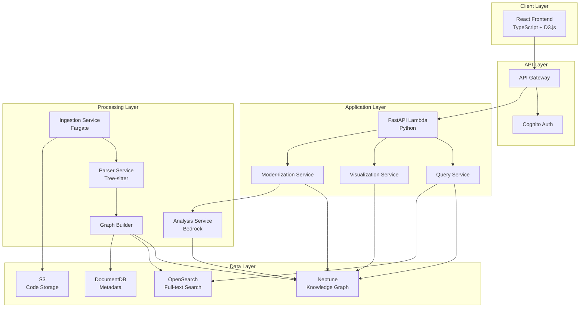

# Design Document: Antar - AI Code Archaeologist

## Overview

Antar is a cloud-native AI platform that transforms legacy codebases into interactive knowledge graphs, enabling developers to understand, navigate, and modernize enterprise systems. The architecture follows a layered approach with distinct discovery, interaction, action, and collaboration layers.

The system ingests legacy code (COBOL, Java, PL/SQL, RPG), parses it into abstract syntax trees, constructs a knowledge graph of relationships, and provides natural language querying, visual exploration, and modernization planning capabilities.

### Key Design Principles

1. **Separation of Concerns**: Clear boundaries between ingestion, analysis, storage, and presentation
2. **Scalability**: Serverless architecture with auto-scaling for variable workloads
3. **Language Agnostic**: Pluggable parser architecture supporting multiple legacy languages
4. **Graph-First**: Knowledge graph as the central data model for all relationships
5. **AI-Augmented**: LLMs for natural language understanding and documentation generation
6. **Bharat-First**: Multilingual support and Indian regulatory context awareness

## Architecture

### High-Level Architecture



### Component Interaction Flow

**Code Ingestion Flow:**
1. User uploads codebase via UI → S3
2. S3 event triggers Ingestion Service (Fargate)
3. Parser Service processes files using Tree-sitter
4. Graph Builder constructs knowledge graph
5. Neptune stores graph, OpenSearch indexes content
6. User receives completion notification

**Query Flow:**
1. User submits natural language query
2. API Gateway authenticates request
3. Query Service sends query to Bedrock for intent extraction
4. Query Service executes Gremlin queries on Neptune
5. Results enriched with code snippets from S3
6. Response returned to UI with visualizations

**Modernization Flow:**
1. User requests modernization analysis
2. Modernization Service analyzes Neptune graph
3. Graph ML identifies cohesive modules
4. Bedrock estimates effort and generates recommendations
5. Results stored in DocumentDB
6. UI displays roadmap with interactive planning

## Components and Interfaces

### 1. Code Ingestion Engine

**Responsibility:** Parse legacy code files and extract structural information

**Technology:** AWS Fargate (containerized Python), Tree-sitter parsers

**Interface:**
```python
class CodeIngestionEngine:
    def ingest_codebase(self, s3_bucket: str, s3_prefix: str) -> IngestionJob:
        """
        Initiates ingestion of a codebase from S3.
        Returns a job ID for tracking progress.
        """
        pass
    
    def get_ingestion_status(self, job_id: str) -> IngestionStatus:
        """
        Returns the current status of an ingestion job.
        """
        pass
    
    def parse_file(self, file_path: str, language: Language) -> ParsedFile:
        """
        Parses a single file and returns its AST representation.
        """
        pass
```

**Key Operations:**
- File type detection based on extension
- Language-specific parser selection (COBOL, Java, PL/SQL, RPG)
- AST extraction with position information
- Error handling for malformed code
- Parallel processing of multiple files

**Parser Architecture:**
- Tree-sitter for Java (mature grammar)
- Custom COBOL parser (ANTLR-based for dialect support)
- Tree-sitter for PL/SQL
- Custom RPG parser (fixed-format handling)

### 2. Knowledge Graph Builder

**Responsibility:** Transform parsed code into graph relationships

**Technology:** Python, NetworkX (local processing), Neptune Gremlin API

**Interface:**
```python
class KnowledgeGraphBuilder:
    def build_graph(self, parsed_files: List[ParsedFile]) -> GraphBuildResult:
        """
        Constructs knowledge graph from parsed files.
        """
        pass
    
    def create_node(self, node_type: NodeType, properties: Dict) -> NodeId:
        """
        Creates a node in the knowledge graph.
        """
        pass
    
    def create_edge(self, source: NodeId, target: NodeId, 
                   edge_type: EdgeType, properties: Dict) -> EdgeId:
        """
        Creates a directed edge between two nodes.
        """
        pass
    
    def merge_duplicate_nodes(self) -> int:
        """
        Identifies and merges duplicate nodes, returns count merged.
        """
        pass
```

**Graph Schema:**

**Node Types:**
- `Function`: name, signature, language, file_path, line_start, line_end, complexity
- `Class`: name, language, file_path, line_start, line_end
- `Module`: name, language, file_path
- `DataStructure`: name, type, fields, file_path
- `BusinessRule`: description, conditions, actions, domain_tags
- `File`: path, language, size, last_modified

**Edge Types:**
- `calls`: Function → Function (call_count, is_recursive)
- `reads`: Function → DataStructure (access_type)
- `writes`: Function → DataStructure (access_type)
- `depends_on`: Module → Module (dependency_type)
- `contains`: Module → Function/Class
- `implements`: Function → BusinessRule
- `inherits`: Class → Class

### 3. Query Service

**Responsibility:** Process natural language queries and retrieve relevant code information

**Technology:** Python FastAPI, Amazon Bedrock (Claude 3.5 Sonnet), Neptune Gremlin

**Interface:**
```python
class QueryService:
    def process_query(self, query: str, language: str, 
                     context: QueryContext) -> QueryResult:
        """
        Processes a natural language query and returns results.
        """
        pass
    
    def extract_intent(self, query: str) -> QueryIntent:
        """
        Uses Bedrock to extract structured intent from natural language.
        """
        pass
    
    def execute_graph_query(self, intent: QueryIntent) -> List[GraphNode]:
        """
        Executes Gremlin query on Neptune based on intent.
        """
        pass
    
    def enrich_results(self, nodes: List[GraphNode]) -> QueryResult:
        """
        Enriches graph nodes with code snippets and explanations.
        """
        pass
```

**Query Intent Schema:**
```python
class QueryIntent:
    intent_type: str  # "find_function", "trace_data_flow", "explain_logic"
    entities: List[str]  # Extracted entity names
    filters: Dict[str, Any]  # Language, module, complexity filters
    scope: str  # "local", "module", "global"
```

**Bedrock Prompt Template:**
```
You are analyzing a legacy codebase. Extract structured intent from this query:

Query: "{user_query}"
Language: {query_language}

Extract:
1. Intent type (find_function, trace_data_flow, explain_logic, find_dependencies, identify_dead_code)
2. Entity names mentioned
3. Any filters (language, module, complexity)
4. Scope (local, module, global)

Return as JSON.
```

### 4. Visual Code Map Service

**Responsibility:** Generate graph visualizations and handle interactive exploration

**Technology:** Python FastAPI, D3.js (client-side), Neptune Gremlin

**Interface:**
```python
class VisualCodeMapService:
    def get_graph_data(self, filters: GraphFilters, 
                      max_nodes: int = 1000) -> GraphVisualization:
        """
        Returns graph data optimized for visualization.
        """
        pass
    
    def get_node_details(self, node_id: str) -> NodeDetails:
        """
        Returns detailed information for a specific node.
        """
        pass
    
    def get_subgraph(self, node_id: str, depth: int) -> GraphVisualization:
        """
        Returns a subgraph centered on a node up to specified depth.
        """
        pass
```

**Visualization Data Format:**
```typescript
interface GraphVisualization {
  nodes: Array<{
    id: string;
    label: string;
    type: NodeType;
    properties: Record<string, any>;
    size: number;  // Based on complexity or importance
    color: string;  // Based on type
  }>;
  edges: Array<{
    source: string;
    target: string;
    type: EdgeType;
    weight: number;
  }>;
  layout: {
    algorithm: "force-directed" | "hierarchical" | "circular";
    parameters: Record<string, any>;
  };
}
```

### 5. Modernization Engine

**Responsibility:** Identify refactoring opportunities and generate modernization plans

**Technology:** Python, Neptune ML (Graph Neural Networks), Amazon Bedrock

**Interface:**
```python
class ModernizationEngine:
    def identify_microservice_candidates(self) -> List[MicroserviceCandidate]:
        """
        Analyzes graph to find cohesive, loosely-coupled modules.
        """
        pass
    
    def calculate_coupling_cohesion(self, module_id: str) -> CouplingCohesionMetrics:
        """
        Calculates coupling and cohesion metrics for a module.
        """
        pass
    
    def estimate_effort(self, candidate: MicroserviceCandidate) -> EffortEstimate:
        """
        Estimates refactoring effort in person-days.
        """
        pass
    
    def generate_roadmap(self, candidates: List[MicroserviceCandidate]) -> ModernizationRoadmap:
        """
        Creates a dependency-ordered modernization roadmap.
        """
        pass
```

**Microservice Candidate Identification Algorithm:**
1. Use Neptune ML to compute node embeddings
2. Apply community detection (Louvain algorithm) to identify clusters
3. Calculate metrics for each cluster:
   - Internal cohesion: ratio of internal edges to total possible
   - External coupling: ratio of external edges to internal edges
   - Suitability score: cohesion / (1 + coupling)
4. Rank clusters by suitability score
5. Filter clusters meeting minimum thresholds

**Effort Estimation Model:**
```python
effort_days = (
    base_loc_factor * lines_of_code / 1000 +
    complexity_factor * cyclomatic_complexity +
    dependency_factor * external_dependencies +
    test_coverage_penalty * (1 - test_coverage)
)

# Factors calibrated from industry data
base_loc_factor = 2.5  # days per 1000 LOC
complexity_factor = 0.5  # days per complexity point
dependency_factor = 1.0  # days per external dependency
test_coverage_penalty = 5.0  # penalty for low coverage
```

### 6. Business Logic Extractor

**Responsibility:** Identify and structure business rules from code

**Technology:** Python, Amazon Bedrock, Pattern matching

**Interface:**
```python
class BusinessLogicExtractor:
    def extract_business_rules(self, function_node: GraphNode) -> List[BusinessRule]:
        """
        Extracts business rules from a function's code.
        """
        pass
    
    def identify_domain_terms(self, code: str) -> List[DomainTerm]:
        """
        Identifies domain-specific terminology in code.
        """
        pass
    
    def explain_rule(self, rule: BusinessRule) -> str:
        """
        Generates natural language explanation of a business rule.
        """
        pass
```

**Extraction Strategy:**
1. Identify conditional statements (if/else, switch/case)
2. Extract conditions and actions
3. Use Bedrock to classify as business rule vs. technical logic
4. Extract domain terms using NER and domain dictionaries
5. Group related rules by semantic similarity

### 7. Documentation Generator

**Responsibility:** Generate human-readable documentation from code

**Technology:** Python, Amazon Bedrock (Claude 3.5 Sonnet)

**Interface:**
```python
class DocumentationGenerator:
    def generate_function_doc(self, function_node: GraphNode) -> FunctionDocumentation:
        """
        Generates comprehensive documentation for a function.
        """
        pass
    
    def generate_module_doc(self, module_node: GraphNode) -> ModuleDocumentation:
        """
        Generates overview documentation for a module.
        """
        pass
    
    def generate_api_doc(self, codebase_id: str) -> APIDocumentation:
        """
        Generates API documentation for public interfaces.
        """
        pass
```

**Documentation Template (Bedrock Prompt):**
```
Generate documentation for this {language} function:

Code:
{source_code}

Context:
- Calls: {called_functions}
- Called by: {caller_functions}
- Reads: {data_read}
- Writes: {data_written}

Generate:
1. Purpose (one sentence)
2. Parameters (name, type, description)
3. Return value (type, description)
4. Side effects
5. Business logic explanation
6. Example usage

Format as markdown.
```

## Data Models

### Neptune Graph Schema

**Vertex Labels:**
- `function`, `class`, `module`, `data_structure`, `business_rule`, `file`

**Edge Labels:**
- `calls`, `reads`, `writes`, `depends_on`, `contains`, `implements`, `inherits`

**Property Types:**
- String: name, file_path, language, description
- Integer: line_start, line_end, complexity, call_count
- Float: suitability_score, cohesion, coupling
- DateTime: created_at, last_modified
- List: domain_tags, parameters

### DocumentDB Collections

**codebases:**
```json
{
  "_id": "ObjectId",
  "name": "string",
  "description": "string",
  "languages": ["COBOL", "Java"],
  "total_files": 1250,
  "total_loc": 450000,
  "ingestion_status": "completed",
  "created_at": "ISO8601",
  "owner": "user_id"
}
```

**ingestion_jobs:**
```json
{
  "_id": "ObjectId",
  "codebase_id": "ObjectId",
  "status": "in_progress",
  "files_processed": 850,
  "files_total": 1250,
  "errors": [],
  "started_at": "ISO8601",
  "completed_at": "ISO8601"
}
```

**annotations:**
```json
{
  "_id": "ObjectId",
  "node_id": "neptune_vertex_id",
  "author": "user_id",
  "content": "string",
  "tags": ["critical", "business_logic"],
  "created_at": "ISO8601"
}
```

**modernization_roadmaps:**
```json
{
  "_id": "ObjectId",
  "codebase_id": "ObjectId",
  "candidates": [
    {
      "module_id": "neptune_vertex_id",
      "suitability_score": 0.85,
      "effort_estimate": {
        "optimistic": 15,
        "realistic": 25,
        "pessimistic": 40
      },
      "dependencies": ["module_id_1", "module_id_2"]
    }
  ],
  "sprints": [
    {
      "sprint_number": 1,
      "candidates": ["candidate_id_1"],
      "total_effort": 25,
      "goals": ["Extract authentication module"]
    }
  ],
  "created_at": "ISO8601"
}
```

### OpenSearch Index Schema

**code_index:**
```json
{
  "mappings": {
    "properties": {
      "node_id": {"type": "keyword"},
      "node_type": {"type": "keyword"},
      "name": {"type": "text", "analyzer": "standard"},
      "file_path": {"type": "keyword"},
      "language": {"type": "keyword"},
      "source_code": {"type": "text", "analyzer": "code_analyzer"},
      "comments": {"type": "text"},
      "complexity": {"type": "integer"},
      "created_at": {"type": "date"}
    }
  }
}
```

**Custom Analyzer:**
```json
{
  "analysis": {
    "analyzer": {
      "code_analyzer": {
        "type": "custom",
        "tokenizer": "standard",
        "filter": ["lowercase", "camelcase_split", "stop"]
      }
    },
    "filter": {
      "camelcase_split": {
        "type": "word_delimiter",
        "preserve_original": true
      }
    }
  }
}
```


## Correctness Properties

A property is a characteristic or behavior that should hold true across all valid executions of a system—essentially, a formal statement about what the system should do. Properties serve as the bridge between human-readable specifications and machine-verifiable correctness guarantees.

### Property 1: Multi-language parsing consistency

*For any* valid source file in a supported language (COBOL, Java, PL/SQL, RPG), parsing should produce a valid abstract syntax tree with all function definitions, variable declarations, and control flow structures extracted.

**Validates: Requirements 1.1, 1.2, 1.3, 1.4, 1.6**

### Property 2: Parse error reporting completeness

*For any* invalid source file, parsing should return an error message containing the line number, error type, and a descriptive explanation.

**Validates: Requirements 1.5**

### Property 3: Dependency preservation

*For any* codebase with file relationships and import dependencies, after ingestion, the stored representation should preserve all original relationships.

**Validates: Requirements 1.7**

### Property 4: Ingestion storage round-trip

*For any* successfully parsed codebase, the parsed representation stored in S3 should be retrievable and equivalent to the original parse result.

**Validates: Requirements 1.8**

### Property 5: Graph node creation completeness

*For any* parsed code containing functions, classes, and modules, the knowledge graph should contain corresponding nodes for each element.

**Validates: Requirements 2.1**

### Property 6: Relationship edge creation

*For any* code relationship (function calls, data reads/writes, control flow dependencies), the knowledge graph should contain a corresponding directed edge with the appropriate label.

**Validates: Requirements 2.2, 2.3, 2.4**

### Property 7: Graph storage round-trip

*For any* constructed knowledge graph, storing it in Neptune and retrieving it should produce an equivalent graph structure.

**Validates: Requirements 2.5**

### Property 8: Node deduplication idempotence

*For any* knowledge graph with duplicate nodes, running the merge operation should consolidate duplicates, and running it again should produce no further changes.

**Validates: Requirements 2.6**

### Property 9: Business rule identification

*For any* code containing conditional statements implementing business rules, the system should identify and extract them as structured data with conditions and actions.

**Validates: Requirements 3.1, 3.2**

### Property 10: Domain term tagging

*For any* business logic containing domain-specific terms, the extracted business rules should include semantic labels for those terms.

**Validates: Requirements 3.3**

### Property 11: Business logic graph association

*For any* extracted business logic, it should be associated with the corresponding knowledge graph node representing the function or module.

**Validates: Requirements 3.4**

### Property 12: Similar logic grouping

*For any* set of code paths implementing similar business logic, the system should group them as related business rules based on semantic similarity.

**Validates: Requirements 3.5**

### Property 13: Unreachable code detection

*For any* knowledge graph, functions with no incoming call edges or unreachable from entry points should be marked as dead code.

**Validates: Requirements 4.1, 4.2**

### Property 14: Unused variable detection

*For any* code with variable declarations, variables that are never read should be marked as unused.

**Validates: Requirements 4.3**

### Property 15: Dead code percentage calculation

*For any* codebase with detected dead code, the calculated percentage should equal (dead_code_lines / total_lines) * 100.

**Validates: Requirements 4.4**

### Property 16: Dead code reporting completeness

*For any* detected dead code instance, the report should include the file path and line number.

**Validates: Requirements 4.5**

### Property 17: Multilingual query processing

*For any* natural language query in English, Hindi, or Hinglish, the query interface should process it and return relevant results.

**Validates: Requirements 5.1, 5.2, 5.3**

### Property 18: Function query retrieval

*For any* query asking about a specific function, the results should include the function definition and its relationships from the knowledge graph.

**Validates: Requirements 5.5**

### Property 19: Data flow tracing

*For any* query asking about data flow, the system should trace the path through the knowledge graph and return the complete sequence.

**Validates: Requirements 5.6**

### Property 20: Ambiguous query clarification

*For any* ambiguous query (multiple possible interpretations), the system should request clarification before returning results.

**Validates: Requirements 5.7**

### Property 21: Empty result suggestions

*For any* query with no matching results, the system should suggest alternative queries or related topics.

**Validates: Requirements 5.8**

### Property 22: Query result completeness

*For any* query result, it should include code snippets, explanations, and links to the visual code map.

**Validates: Requirements 5.9**

### Property 23: Node type color encoding

*For any* graph visualization, different node types (functions, data, modules) should be assigned different colors consistently.

**Validates: Requirements 6.2**

### Property 24: Microservice candidate identification

*For any* knowledge graph module with high internal cohesion (>0.7) and low external coupling (<0.3), it should be identified as a microservice candidate.

**Validates: Requirements 7.1, 7.2**

### Property 25: Suitability score calculation

*For any* microservice candidate, the suitability score should be calculated as cohesion / (1 + coupling).

**Validates: Requirements 7.3**

### Property 26: Candidate ranking order

*For any* set of microservice candidates, they should be ranked in descending order by suitability score.

**Validates: Requirements 7.4**

### Property 27: Candidate presentation completeness

*For any* microservice candidate presentation, it should include module boundaries, dependencies, and estimated extraction effort.

**Validates: Requirements 7.5**

### Property 28: LOC estimation

*For any* microservice candidate, the estimated lines of code to refactor should equal the sum of lines in all functions within the module boundaries.

**Validates: Requirements 8.1**

### Property 29: Effort estimation factors

*For any* two microservice candidates where one has higher complexity, more dependencies, or lower test coverage, the one with worse metrics should have a higher effort estimate.

**Validates: Requirements 8.2, 8.5**

### Property 30: Effort estimate format

*For any* effort estimate, it should include three values (optimistic, realistic, pessimistic) in person-days, where optimistic ≤ realistic ≤ pessimistic.

**Validates: Requirements 8.4**

### Property 31: Dependency-ordered sequencing

*For any* set of microservice candidates with dependencies, the generated sequence should respect topological ordering (prerequisites before dependents).

**Validates: Requirements 9.1, 9.3**

### Property 32: Sprint grouping by effort

*For any* modernization roadmap, candidates should be grouped into sprints such that the total effort per sprint is balanced and within reasonable bounds.

**Validates: Requirements 9.2**

### Property 33: Roadmap presentation completeness

*For any* modernization roadmap, it should include sprint goals, deliverables, and risk factors for each sprint.

**Validates: Requirements 9.4**

### Property 34: Cumulative effort calculation

*For any* modernization roadmap, the cumulative effort should equal the sum of all individual candidate effort estimates.

**Validates: Requirements 9.5**

### Property 35: Documentation generation completeness

*For any* function documentation, it should include a purpose description, parameter descriptions, return value description, and side effects.

**Validates: Requirements 10.1, 10.2**

### Property 36: Business logic documentation

*For any* function containing business logic, the generated documentation should include plain language explanations of the domain rules.

**Validates: Requirements 10.3**

### Property 37: Documentation format validation

*For any* generated documentation, it should be valid markdown with properly formatted code blocks.

**Validates: Requirements 10.5**

### Property 38: Annotation graph association

*For any* created annotation, it should be associated with the corresponding knowledge graph node and retrievable via that node.

**Validates: Requirements 11.2**

### Property 39: Annotation query inclusion

*For any* query result for a node with annotations, the annotations should be included in the results.

**Validates: Requirements 11.3**

### Property 40: Annotation indicator presence

*For any* graph visualization node with expert annotations, the node should have a visual indicator.

**Validates: Requirements 11.4**

### Property 41: Annotation metadata completeness

*For any* saved annotation, it should include author and timestamp metadata.

**Validates: Requirements 11.5**

### Property 42: Onboarding pathway generation

*For any* developer role, the system should generate an onboarding pathway with identified critical modules and business logic.

**Validates: Requirements 12.1, 12.2**

### Property 43: Pathway sequencing

*For any* onboarding pathway, learning modules should be sequenced from foundational to advanced based on dependency relationships.

**Validates: Requirements 12.3**

### Property 44: Progress tracking and suggestions

*For any* completed pathway module, the system should track progress and suggest the next module in the sequence.

**Validates: Requirements 12.4**

### Property 45: Pathway content completeness

*For any* onboarding pathway, each module should include documentation, code examples, and quiz questions.

**Validates: Requirements 12.5**

### Property 46: Criticality checking

*For any* code component modification attempt, the system should check if the component is marked as critical and provide appropriate warnings.

**Validates: Requirements 13.1**

### Property 47: Dependent count warning

*For any* component with N dependents, modification warnings should display the count N and list affected modules.

**Validates: Requirements 13.2, 13.4**

### Property 48: Business logic modification alert

*For any* component implementing core business logic, modification attempts should trigger alerts to review business rules.

**Validates: Requirements 13.3**

### Property 49: High-risk modification recommendations

*For any* high-risk modification (many dependents or core business logic), the system should recommend additional testing or review.

**Validates: Requirements 13.5**

### Property 50: Version history retrieval

*For any* code component, the system should retrieve its complete version history including commits, authors, and timestamps.

**Validates: Requirements 14.1, 14.2**

### Property 51: Historical version display

*For any* selected historical version of a component, the displayed code should match the code as it existed at that commit.

**Validates: Requirements 14.3**

### Property 52: Version diff accuracy

*For any* two versions of a component, the diff should correctly highlight all additions, deletions, and modifications.

**Validates: Requirements 14.4**

### Property 53: Business logic change explanation

*For any* version comparison where business logic changed, the system should explain what rules were added, removed, or modified.

**Validates: Requirements 14.5**

### Property 54: Language switching state preservation

*For any* user session, switching language preferences should preserve the current context and state.

**Validates: Requirements 15.4**

### Property 55: Selective code translation

*For any* code display in a non-English language, the code syntax should remain unchanged while comments and documentation are translated.

**Validates: Requirements 15.5**

### Property 56: Search scope completeness

*For any* search term, the search should cover function names, variable names, and comments.

**Validates: Requirements 16.1**

### Property 57: Search result relevance ranking

*For any* search results, they should be ranked in descending order by relevance score.

**Validates: Requirements 16.3**

### Property 58: Filter application correctness

*For any* applied filter (language, module, complexity), all returned results should match the filter criteria.

**Validates: Requirements 16.4**

### Property 59: Search result format

*For any* search result, it should include a code snippet with the search term highlighted.

**Validates: Requirements 16.5**

### Property 60: Authorization enforcement

*For any* authenticated user attempting to access a codebase, the system should check authorization and deny access if permissions are insufficient.

**Validates: Requirements 17.3, 17.4**

### Property 61: Permission assignment

*For any* newly created user, the system should assign role-based permissions according to their assigned role.

**Validates: Requirements 17.5**

### Property 62: Graph backup creation

*For any* knowledge graph update, the system should create an automated backup in Neptune.

**Validates: Requirements 19.2**

### Property 63: API authentication requirement

*For any* API request without a valid authentication token, the system should return an authentication error.

**Validates: Requirements 20.2**

### Property 64: API JSON response format

*For any* successful API call, the response should be valid JSON.

**Validates: Requirements 20.3**

### Property 65: Rate limit response

*For any* API request exceeding rate limits, the system should return HTTP 429 status with a retry-after header.

**Validates: Requirements 20.4**

### Property 66: API error response format

*For any* API error, the response should include a descriptive error message and an error code.

**Validates: Requirements 20.5**


## Error Handling

### Error Categories

**1. Parsing Errors**
- Syntax errors in source code
- Unsupported language dialects
- Malformed file encoding

**Strategy:**
- Return structured error with line number, column, and error type
- Continue processing other files in batch
- Store partial results with error annotations
- Provide suggestions for common syntax issues

**2. Graph Construction Errors**
- Circular dependencies
- Missing node references
- Schema validation failures

**Strategy:**
- Log detailed error context (file, function, relationship)
- Skip problematic edges while preserving valid graph structure
- Flag affected nodes for manual review
- Provide graph consistency report after construction

**3. Query Processing Errors**
- Bedrock API failures
- Neptune query timeouts
- Ambiguous or malformed queries

**Strategy:**
- Retry transient failures with exponential backoff
- Fall back to simpler query strategies on timeout
- Return partial results with error explanation
- Cache successful query patterns for faster retry

**4. Authentication/Authorization Errors**
- Invalid credentials
- Expired tokens
- Insufficient permissions

**Strategy:**
- Return clear error messages without exposing security details
- Log failed attempts for security monitoring
- Provide guidance on obtaining proper permissions
- Implement rate limiting on failed auth attempts

**5. Resource Exhaustion**
- Neptune capacity limits
- Lambda timeout
- S3 storage limits

**Strategy:**
- Implement circuit breakers for dependent services
- Queue large operations for async processing
- Provide progress indicators for long-running operations
- Auto-scale resources based on load

### Error Response Format

All API errors follow this structure:

```json
{
  "error": {
    "code": "PARSE_ERROR",
    "message": "Failed to parse COBOL file",
    "details": {
      "file": "ACCOUNT.CBL",
      "line": 142,
      "column": 23,
      "suggestion": "Missing period after PROCEDURE DIVISION"
    },
    "request_id": "uuid",
    "timestamp": "ISO8601"
  }
}
```

### Logging and Monitoring

**CloudWatch Logs:**
- Structured JSON logging for all components
- Log levels: DEBUG, INFO, WARN, ERROR, CRITICAL
- Include request_id for tracing across services

**CloudWatch Metrics:**
- Ingestion success/failure rates
- Query latency (p50, p95, p99)
- Graph construction time
- API error rates by endpoint
- Neptune query performance

**CloudWatch Alarms:**
- Error rate > 5% for any component
- Query latency p95 > 3 seconds
- Neptune CPU > 80%
- Lambda concurrent executions > 80% of limit

## Testing Strategy

### Dual Testing Approach

Antar requires both unit testing and property-based testing for comprehensive coverage:

- **Unit tests**: Verify specific examples, edge cases, and error conditions
- **Property tests**: Verify universal properties across all inputs

Both approaches are complementary and necessary. Unit tests catch concrete bugs in specific scenarios, while property tests verify general correctness across a wide range of inputs.

### Property-Based Testing

**Framework:** Hypothesis (Python)

**Configuration:**
- Minimum 100 iterations per property test
- Each test tagged with feature name and property number
- Tag format: `# Feature: antar, Property N: [property description]`

**Example Property Test:**

```python
from hypothesis import given, strategies as st
import pytest

# Feature: antar, Property 1: Multi-language parsing consistency
@given(
    language=st.sampled_from(['COBOL', 'Java', 'PL/SQL', 'RPG']),
    source_code=st.text(min_size=10, max_size=1000)
)
@pytest.mark.property_test
def test_parsing_produces_valid_ast(language, source_code):
    """
    For any valid source file in a supported language,
    parsing should produce a valid AST.
    """
    # Generate valid code for the language
    valid_code = generate_valid_code(language, source_code)
    
    # Parse the code
    result = parser.parse_file(valid_code, language)
    
    # Verify AST is valid
    assert result.is_success()
    assert result.ast is not None
    assert result.ast.has_functions() or result.ast.has_classes()
```

**Custom Generators:**

Antar requires custom generators for:
- Valid COBOL programs (with proper divisions and sections)
- Valid Java classes (with proper syntax)
- Valid PL/SQL procedures
- Valid RPG programs
- Knowledge graphs with various topologies
- Business logic patterns
- Query intents in multiple languages

### Unit Testing

**Framework:** pytest (Python), Jest (TypeScript)

**Focus Areas:**
- Specific parser edge cases (empty files, single-line programs)
- Error handling scenarios (malformed code, missing dependencies)
- Integration points (Bedrock API, Neptune queries)
- Business logic extraction patterns
- Authentication flows
- API endpoint contracts

**Example Unit Test:**

```python
def test_cobol_parser_handles_empty_file():
    """Test that empty COBOL files are handled gracefully."""
    result = parser.parse_file("", "COBOL")
    assert result.is_error()
    assert "empty file" in result.error_message.lower()

def test_dead_code_detection_with_no_entry_points():
    """Test dead code detection when no entry points exist."""
    graph = create_test_graph_with_isolated_functions()
    dead_code = analyzer.detect_dead_code(graph)
    assert len(dead_code) == graph.function_count()
```

### Integration Testing

**Scope:**
- End-to-end ingestion pipeline (S3 → Parser → Graph → Neptune)
- Query flow (UI → API Gateway → Lambda → Neptune → Response)
- Modernization analysis (Graph → ML → Recommendations)

**Tools:**
- LocalStack for AWS service mocking
- Docker Compose for local environment
- Postman/Newman for API testing

**Example Integration Test:**

```python
@pytest.mark.integration
def test_end_to_end_ingestion():
    """Test complete ingestion pipeline."""
    # Upload test codebase to S3
    s3_client.upload_file("test_codebase.zip", bucket, "test/")
    
    # Trigger ingestion
    job = ingestion_engine.ingest_codebase(bucket, "test/")
    
    # Wait for completion
    wait_for_job_completion(job.id, timeout=300)
    
    # Verify graph was created
    graph = neptune_client.get_graph(job.codebase_id)
    assert graph.node_count() > 0
    assert graph.edge_count() > 0
    
    # Verify search index was created
    results = opensearch_client.search("test_function")
    assert len(results) > 0
```

### Performance Testing

**Tools:** Locust, Apache JMeter

**Scenarios:**
- Concurrent user queries (100 users, 1000 queries)
- Large codebase ingestion (1M LOC)
- Graph traversal performance (10K node graphs)
- API throughput (1000 req/sec)

**Acceptance Criteria:**
- Query latency p95 < 2 seconds
- Ingestion throughput > 30K LOC/minute
- API availability > 99.9%

### Test Coverage Goals

- Unit test coverage: > 80% for core logic
- Property test coverage: All 66 correctness properties
- Integration test coverage: All critical user flows
- API test coverage: 100% of endpoints

### Continuous Integration

**Pipeline:**
1. Run unit tests on every commit
2. Run property tests (100 iterations) on every PR
3. Run integration tests on merge to main
4. Run performance tests nightly
5. Deploy to staging on successful tests
6. Manual approval for production deployment

**Quality Gates:**
- All tests must pass
- Code coverage must not decrease
- No critical security vulnerabilities (Snyk scan)
- API contract tests must pass (Pact)

